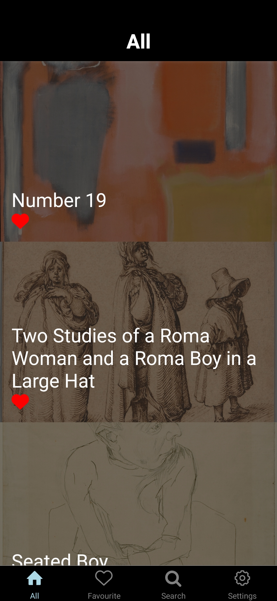
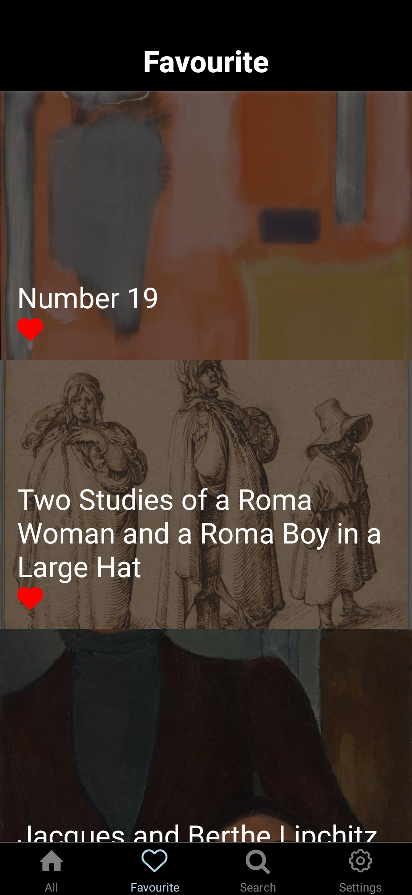
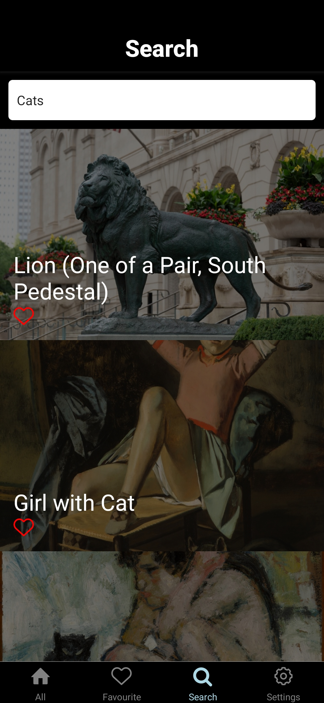
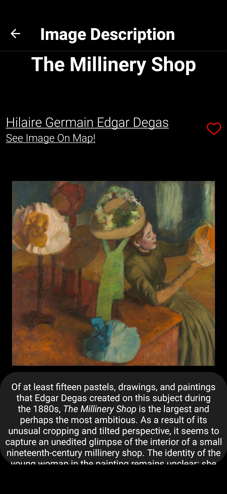
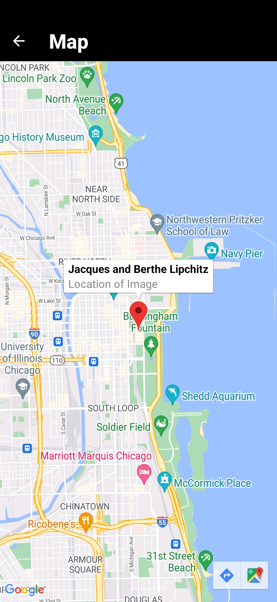
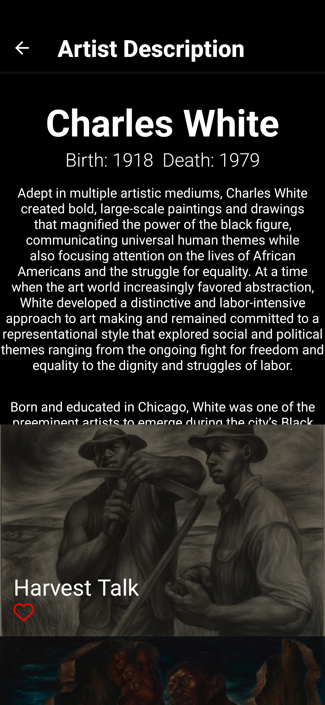

# ARTIC

My first application made in React Native with Expo, uses [Art Institute of Chicago API](https://api.artic.edu/docs/).

1. Home Screen 
2. Favourites Screen 
3. Search Screen with searching after each letter change in search bar. 
4. Image Description with Title, Author Name, Image, Description and link to location of this artwork on map (if included in API) 
   - Map 
5. Artist Description with his Name, Dates of Birth/Death, List of his Artworks and Scrollable Description 
6. Other:
   - Option do remove all favourites, scrollable lists with Pagination & Refreshing, Liking Images from each Screen.
